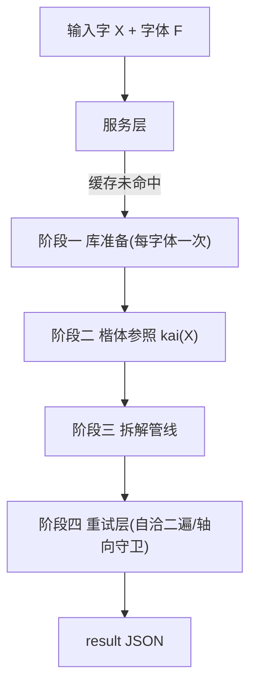
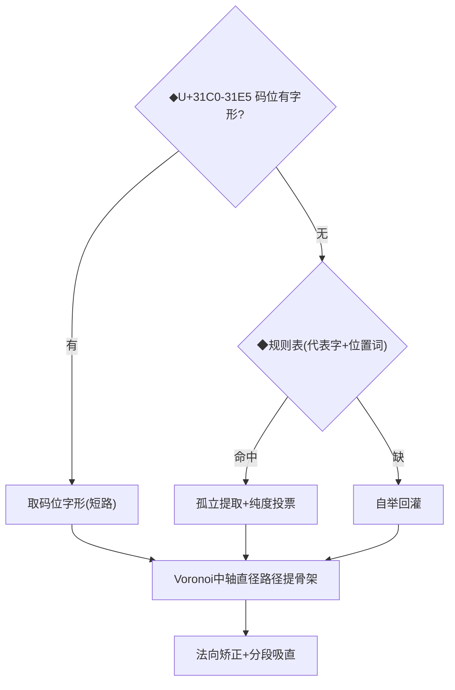

# 任意字输入 → 拆解结果:全流程审查图 v2(2026-09-26,对照 c7689f8 实码)

> 用途:用户审查。◆=判定点(阈值/开关),⚠=已知薄弱点。
> 每环节注明**为解决什么问题而生**与**不做会怎样**(括号内为逼出该
> 环节的事故字例——全部来自代码注释里的事故档案,非虚构)。

## 0. 总览

| 层 | 解决什么问题 | 不做会怎样 |
|---|---|---|
| Future 去重 | 前端连点/多字特效场并发请求同一字,重复整管线拆解 | 8 路并发同字算 8 遍(实测改后只算 1 次) |
| bytes LRU 缓存 | 每次命中都重新 json.dumps ~550KB | /api/library 重复请求 43.7ms(改后 4.7ms) |

## 1. 阶段一:库准备——"用目标字体自己的笔形当模板"

**存在理由**:拆分需要"每种笔画在这个字体里长什么样"的标准形。用楷体
形状当模板在字体风格差异大时必错——bbox 映射楷体中线在臂比悬殊时会
斜穿墨块(己 的短竖横折映到鸿蒙长竖㇕曾不可救药)。故 B 库=目标字体
自绘形态,楷体只保留"类型对应+书写方向"两个信息。

| 环节 | 解决什么问题 | 不做会怎样(字例) |
|---|---|---|
| 码位短路 | 码位字形是设计师亲手给的该字体标准笔形,最权威且零提取误差 | 有码位的字体(宋体)白白走提取,还可能混入邻墨 |
| 规则表提取 | 多数字体无码位区,须从"含该笔画的最简代表字"里剥离标准形 | 缺模板的类型全退化楷体中轴,形态错配 |
| 纯度投票(显式60%/其余95%) | 提取的连通组可能混入邻笔墨,票选保纯 | 黑体八的撇纯度77%曾被95%一刀切错杀→对显式探针放宽 |
| 自举回灌 | 规则表覆盖不到的长尾类型,用管线拆简单字反哺库 | 长尾类型永远没有模板 |
| Voronoi 直径路径骨架 | 骨架形态完全取决于字体自身几何(臂长比例/弯直),楷体不参与——用户架构裁定 | 楷体中线映射在臂比悬殊时斜穿墨块(己→鸿蒙㇕) |
| 端枝剪除(0.9×中位余隙) | 矩形端帽处中轴分叉出45°角枝,直径路径会带上一条 | 骨架端部长出斜刺 |
| 剪除弧长上限(2.4×+8) | 衬线楔形笔全长渐细,把中位余隙压到楔中段,无上限会剪掉近半尾锋 | simsun 撇骨架只剩0.78覆盖→威8撇 D 过短输掉尾段只剩一半 |
| 分段吸直 | 同类型骨架拓扑必须一致(横折=干净7字两直段),压 Voronoi 采样锯齿 | 楷体回退带弧弯变C样,直笔带锯齿 |
| .blibCache(字体签名×算法签名) | 建库30s+,签名保证算法一变缓存自动作废 | 每次启动重建/或用陈旧缓存跑新算法 |

已修(2026-09-26)原⚠"码位短路无同型校验":映射取形链(码位直取/探针
提取统一)接入建库同型校验 `fonthub._typeCheckAccept`——候选骨架 vs
A库同类型参照中轴,等比归一+弧长等分24点,判据=0.5·均距+0.5·端点距,
◆阈值 `MAP_TYPECHECK_DEV=0.67`;超阈落到下一候选,全灭保留最优并标
`typeCheckWarn`。标定(tools/calib_typecheck.py):17字体 1015 条映射
候选、可检 309 条,健康超阈仅 2 条(**误拒率 0.65%**,均为显示体
竖折折 提取件,经全灭保底原样保留,健康主选零变更);本案两例既往
错形均以 dev 0.719 被拒——捺←0x31D2(㇒镜像形:两臂中段交叉把均距
稀释到 0.541,端点距 0.897 锁定)、横撇←0x31D6(㇖缺下落臂,端点距
0.781)。方言噪声桶型(横捺撇等)几何上无单一正形(楷体把 好4 的 ㇇
画得极浅,㇖ 反比 ㇇ 更贴楷体样例——标定实测),不走几何校验:其治本
是 kaiTypeFixes 部件裁决清源(横捺撇 75 字→横折68/横撇5/横钩2,
好·笔4 拿回撇段,目检 SVG 归档 verifyOut/hnp_fix/),且 dbuild 对
方言型映射候选另有 0.18 严闸兜底。同病灶第三通路——相似组借用门:
楷体把 子部㇇ 画得极浅(好4 中轴 y 跨 120/1024),本型 ㇇ 模板对浅
先验 dev 0.294-0.299 恰被 0.28 闸拒,㇖ 反以 dev 0.109 经借用门回流
(鸿蒙/宋体 好 目检)。横撇已整体退出相似组(双向皆害,见
classify.SIMILAR_GROUPS 注):浅先验走楷体回退(位置对),深先验用
本型 ㇇。

## 2. 阶段二:楷体参照——"结构真值从哪来"

**存在理由**:拆分的目标定义(几笔/什么类型/什么顺序/属哪个部件)不在
目标字体里,全部来自楷体参照(makemeahanzi)。这是"参照锚定"路线的根。

| 环节 | 解决什么问题 | 不做会怎样(字例) |
|---|---|---|
| strokeTypes 逐笔分类 | graphics 只有中轴坐标,类型要从几何归纳 | 没有类型就无法选 B 模板 |
| kaiTypeFixes 修正表 | classifyMedian 对个别字误判,用部件一致性审计的多数派裁决修正 | 魂3 竖折被判撇折→模板全错;横捺撇噪声桶75字(2026-09-26 裁决→横折/横撇/横钩,好·子部㇇曾丢撇段);注意只套复合笔形(全量套用曾使抽样 80.8→78.6) |
| deepenMatches 槽位细化 | 原始 matches 只标一层,部件仲裁/动画寻址需要深层路径 | 森 的三个木无法分别寻址;⚠混合深度8392字/?占位383字(单缺口1376字可排除法补全,未做) |
| 结构树+components | IDS 递归解析,给槽位 bbox/部件动画/语义特效供数 | 偏旁交换/生长链无从谈起 |

## 3. 阶段三:管线主干

### 3.1 分组与 D 构建

| 环节 | 解决什么问题 | 不做会怎样(字例) |
|---|---|---|
| 绕向判孔 | 外环/孔洞语义,布尔运算与归属都依赖 | 孔被当实体,回 的腔算成墨 |
| 交叠并组(◆组数>笔数 且 面积>25) | 装饰字体一笔画成多件(快乐体),要并回一件;门控防正常字被乱并 | 不并:一笔的两件各自认领笔画;乱并:独立笔画被焊死成融合组 |
| 全局仿射对齐 | 楷体结构坐标→目标字形坐标,所有"名义位置"的地基 | 楷体先验完全没法用 |
| D 构建(B模板按楷体包围盒放置) | 归属打分需要每笔的初始形态+位置假设:形态取字体自己(B),位置取楷体结构(C) | 没有 D 就只能盲分 |
| 相似组借用(◆本型优先0.08) | 字体设计摇摆:月 的竖实为竖撇,本型模板反而错 | 无借用:设计摇摆字错配;无0.08门:微弱优势借用曾把鸿蒙的横全换成提模板、竖换弯钩;2026-09-26 横撇退组:㇖曾借道回流吞掉 好4 撇段 |
| 形态偏差门(0.18/0.28) | 映射候选必须明显贴合才有资格顶替楷体回退 | 女1 竖捺曾被巡·右㇛模板以0.28松闸顶掉,打乱女旁划分 |

### 3.2 指派(assign)

| 环节 | 解决什么问题 | 不做会怎样(字例) |
|---|---|---|
| G0 墨距离 costRows | 笔→组的基础归属证据;距离法对带状/实心都稳 | inside占比法对⊓形带状轮廓失效:鸿蒙日 的竖中轴悬在空腔里,占比=0 |
| penMatrix 杆⊥罚(200) | 横竖笔锚进与楷体轴向垂直的杆=铁证错锚,锚定期就拦 | 博6横 直出竖杆类错锚要等 G6 事后救 |
| penMatrix 点锚大墨罚(250) | 点笔锚进大墨块会吞邻笔 | 点当组主吸走整条横 |
| barcap 罚(200,2b) | G5 的"杆装不下该笔"是 unary 证据,前移到锚定期一次解决 | G5 事后链修:触发40%采纳3%纯空转;前移后主门+11字 |
| G1 匈牙利全局锚定 | 每组保底一笔、全局最优,防空组 | 逐笔独立argmin曾让 㡭 的点挤进邻笔组、正主组空置沦为全开竞争 |
| S1b 空组语义认领 | 组数>笔数时有"休眠件"(网 的内点),空组按语义找主 | 休眠件永远无主,全开竞争搅乱归属 |
| ⚠罚只进匈牙利矩阵 | **红线**:罚写进 costRows 本体会堵死后续仲裁的回家路 | 爱5竖 的教训:罚污染基础代价后 G3 无法把它救回 |

### 3.3 仲裁链(G2..G8.5F)——"先错分再逐级修"的证据分层

**存在理由**:G0/G1 只有墨距离一种证据,对轴向/尺寸/次序/部件语义全部
失明。每级仲裁补一种证据,各带采纳门防级联误伤(链上每级都有事故史)。

| 级 | 补充的证据 | 解决的病(字例) |
|---|---|---|
| G2 走廊可容纳度 | 笔的骨架走廊在组内有没有立足之地 | 初错分但墨距离接近的笔改判回正主组 |
| G3 部件亲缘(前缀相容) | 同部件的笔应同组 | 爱 的5竖错组/6横钩折返(部件同组仲裁的出生字例) |
| G4 杆超载+蹲杆 | 单杆组挤两根平行笔=必有一错;弦>2×杆厚=蹲杆 | 甲 曾 cov[1.0,0.5]——双横挤单横带被钉死 |
| G5 抢杆认领链 | 长笔占杆→杆主流浪→孤儿墨无人认领的三步换家 | ⚠barcap 前移后基本空转,保留兜漏网 |
| G6 轴向错家全排列 | 横竖直出垂直杆=铁证;名单内全排列家数守恒 | 博 6横占竖杆/11竖撇占横杆/8竖占斜片三笔连环——同型两两互换救不了跨型链 |
| G7 槽位互换 | 种子统计92.2%部件笔数与楷体一致,槽位错位是最硬的换家证据 | 跨槽跨型连环错位 |
| G8 楷序互换 | 墨距离代价接近时同型笔"家"分反 | 狗 的犭撇/勹撇左右互换(偏差500+)、根 的木4点上蹿;⚠采纳率3.7%且有目族5字误换病例(豁免判据未做) |
| G8.5 梯队秩配对 | 梯子部件横档"整体错一位",逆序检不出,须保序秩配对 | 搏博縛鎛 档链下移一格链头吞框(AREA 2%→12%);卑族档抢撇(TYPE 33-78°) |
| G8.5-F 融合框 | 框+档融成一组时条组路径失明,用组级中轴交叉行当档位锚 | simsun 鬼白魁鳃 框内档错位/挤带 |

⚠ 结构性弱点:整链是修补式,矩阵归并(unary 证据统一进锚定一次求解)
只走完第一拍;G2 走廊未归并;交叉区(威横/我平撇/永钩)靠采样投票,
无联合仲裁。

### 3.4 锚定与迭代(anchor+iterate)

| 环节 | 解决什么问题 | 不做会怎样(字例) |
|---|---|---|
| G9 组局部重锚定(◆覆盖<0.8) | 全局仿射是绝对定位,部件比例悬殊时组内名义布局整体错位——改用组内相对布局重映射 | 磷 的石口高瘦,楷体口三笔名义挤在组上半段,封底横悬在腔体中间;⚠门控是命门:v10 无门控全量复位净负收益(放对的也被搬乱) |
| ladderTouched 豁免 | G9 是整组仿射复位,会把梯队层刚锚好的带位搬走 | 对抗评审实锤的自拆台 |
| G10 断面吸附 | 名义中轴悬空/骑缝的笔吸到就近实体断面 | ⚠35%支撑阈值是绝对值,simsun 95%触发/33%采纳(无量纲化欠账) |
| contourAllowed 冻结 | 归属评分按连通组分治,每轮廓只允许本组笔竞争 | 跨组抢样本,分治失效 |
| 采样归属迭代×5(d/halfW+0.5·dirPen) | 距离带+切向一致的软归属,逐轮收敛 | 只按初始 D 一锤定音,精调空间为零 |
| 饿死楷体回退(◆<6样本) | B 模板劣质/错位时(TC 竖变体),退楷体中轴重新参赛——位置由结构C保证,只输形态不输位置 | 劣质模板的笔颗粒无收直接失踪 |
| refineMedianFit | D 形态好位置差,按己方已分派样本平移/分段拉拽 | 位置误差全程带到切割 |
| recenterMedian(◆位移上限0.6×笔宽) | 只按己方样本拟合会贴边漂移(口 的竖贴内侧缘,外缘样本被邻笔抢) | 无上限:交叉区断面中点在两笔间跳,汉·横撇 蛇形折返;先前爱横钩曾折返17次(滑动中位数滤波同因) |
| 终态吸直 | 精调/居中在融合区残留之字抖动 | 中轴折返几十次 |

### 3.5 切割与重构(cutting)

| 环节 | 解决什么问题 | 不做会怎样(字例) |
|---|---|---|
| 主人判定整体归属 | 交叠区整块墨须整体归属,逐样本会碎片化 | 交叉区碎成马赛克 |
| 边弧整体归属 | 轮廓弧段作为整体归一笔,切点只落在标签跳变处 | 弧段被切成细碎小段 |
| 标签平滑 | 孤立异常标签样本(噪声)会制造伪切点 | 多余的碎切口 |
| De Casteljau 精确切割 | 贝塞尔曲线上的数学精确分割——全程矢量,无像素化 | 项目的立身之本(并集恒等的前提) |
| 环路追踪+直割线弦+笔锋桥 | 切出的弧段要串回闭合路径;断口用弦连,笔锋处用贝塞尔桥 | 弧段散落无法成笔;⚠桥是三角形连接件,搭错位置=simkai草 的"凭空小三角"(在原字墨内,不破恒等) |
| 跨轮廓并环+孔洞径向对应 | 环形笔画(口)由多条轮廓合成;孔按所属外环分配 | 口 拆成两半;全局减孔曾把 中 的中竖在口腔处挖断 |
| 碎片环剪除(<主环45%) | 切割残留的小环是伪影 | 笔画带着碎渣 |

### 3.6 收口链(finalize.sealUnion)——"并集恒等的最后防线"

**存在理由**:硬不变量"所有笔画并集==原字形"(不多不少)。切割/归属的
任何误差在这里强制修平——但**只保恒等不保形态**(⚠毛边/桥三角/被啃
的臂都能通过恒等校验,形态修复器为此而生,现为半成品默认关)。

| 环节 | 解决什么问题 | 不做会怎样(字例) |
|---|---|---|
| rescueStarved 饿死救济 | 颗粒无收/零宽退化的笔,用骨架走廊∩组区域重建实体 | 宾 的宀左点曾只得一段边界线 |
| clampStrokes 裁剪+残差回填 | 不多:逐笔∩原形裁越界;不少:未覆盖面片按共享边界给同组邻笔 | 溢出/白缝 |
| resolveKaiDisjointOverlaps | 楷体不相交的笔对在结果里大重叠=必有一错,内横保带外框让位 | 亨/亭/勤 封底横被外框100%包含 |
| enforceConnectivity | **用户硬裁定:同一笔画不可能不连通** | 断笔碎片 |
| reUnionCheck 真实口径终检 | clampStrokes 返回值基于裁剪区域,会掩盖未替换路径的残余溢出 | 假绿灯 |
| fillResidualGaps(◆cover<99.95) | 0.5%容差内可见白缝无条件回填 | 爱 冖区 0.4% 白缝 |
| 强制收口(◆excess>0.5) | 连通性搬运/奇偶翻转可能收口后再引入溢出 | 流江水 曾终态溢出19% |
| 组区域按组减孔 | 孔只挖自己外环的组区域再并 | 全局减孔把 中 的中竖挖断 |

### 3.7 终态陈述

| 环节 | 解决什么问题 | 不做会怎样 |
|---|---|---|
| 终态中轴重提(◆仅折返>75°触发) | 交叉区断面居中的蛇形伪影,切割定稿后单笔中轴才良定义 | 汉·横撇 中轴3处>90°折返;⚠仅折返触发——不到阈的小歪线全放行(中线难看的直接原因) |
| shapeSim / retain / trace | 质量陈述+决策迹(13级审计) | 无法诊断/无胜率表 |
| holeCount/holes | 空腔标记(并集内环,轮廓层看不见——鸿蒙框是两个L件搭接) | 洞内特效无锚点 |

## 4. 阶段四:重试层

| 环节 | 解决什么问题 | 不做会怎样(字例) |
|---|---|---|
| 自洽二遍(◆非满分触发) | 第一遍拆完的干净单笔中轴当种子重跑——结构先验已被消化成"这个字体里的实际位置",第二遍起点更准 | 一遍定生死,D 初始误差无法自愈 |
| FrontReuse 前段复用 | 重试遍的解析/对齐/D构建与首遍相同,免复算 | 重试字白付2×前段 |
| ◆双指标采纳门(retain升 且 sim不明显降 + 并集守卫) | 防吞并式虚高:一笔吞掉邻笔 retain 也会涨 | 流江水 二遍曾溢出14.2%仍被 retain 虚高采纳 |
| 轴向守卫(◆横竖主轴偏>32°) | verify TYPE 同款判据前移:病笔换楷体种子重跑 | TYPE 失败等人工;⚠守卫种子会把梯队层刚纠正的笔播回错位(已加排除名单) |
| ◆四指标不倒退门 | 病笔数降 且 failed/retain/sim/并集全不倒退才采纳 | 修一个砸三个 |

## 5. 审查提示:决定权分布与已知欠账

| 问题 | 决定环节 | 欠账 |
|---|---|---|
| 归属对不对 | assign+仲裁链+iterate | 交叉区联合仲裁未做;矩阵归并只走一拍;G8误换豁免未做 |
| 边界切在哪 | iterate投票+cutting | 形态先验不参与边界(毛边源头);形态修复器半成品 |
| 中线质量 | 骨架折线+精调拉扯+条件重提 | 无条件重提+曲线拟合未做(已评估,待裁定) |
| 形态像标准笔画吗 | 无环节负责 | 仅事后软指标 morphBad;修复器门禁未走完 |
| 部件识别 | 楷体matches锚定 | ?占位/混合深度;排除法补全1376字未做 |
| 阈值量纲 | 各级散落 | G10 等绝对阈值未无量纲化(评审#2欠账) |
