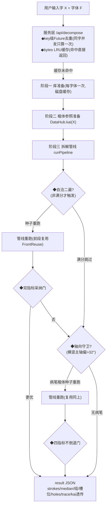
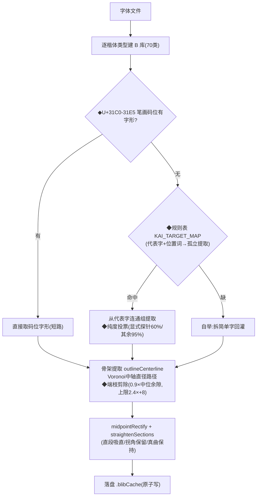
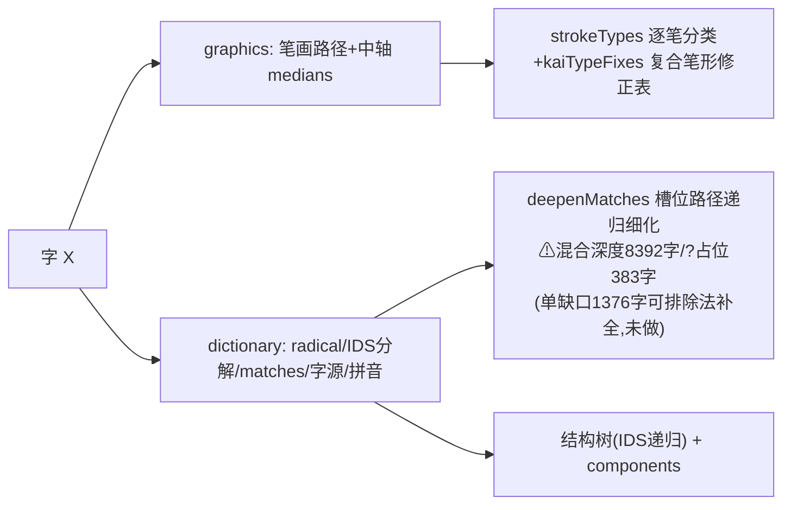
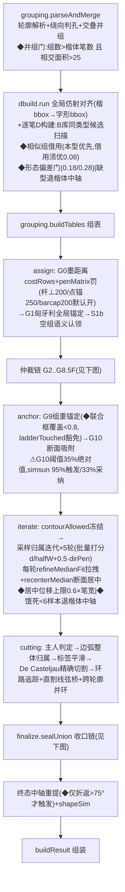
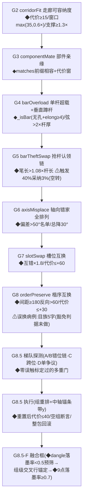
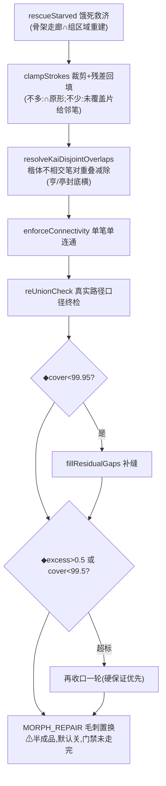

# 任意字输入 → 拆解结果:全流程审查图(2026-09-26,对照 c7689f8 实码)

> 用途:用户审查。图中 ◆=判定点(括号内为阈值/开关),⚠=已知薄弱点。
> 阶段名与代码模块一一对应(strokelab/pipeline/ 包)。

## 0. 总览:一次请求的完整旅程

⚠ 重试层:重试遍是整管线复跑(重试字耗时约 2×),采纳门只看聚合指标,
单笔变差聚合仍升会被采纳(蝮 曾被二遍顶出 OVERLAP,靠 veto 补丁挡)。

## 1. 阶段一:库准备(每字体一次,.blibCache 按 字体签名×算法签名 缓存)

⚠ 码位短路信任码位字形与楷体同型——捺曾因码位笔误(0x31D2撇)整族取到
镜像形,宋体首当其冲(已修,但同类映射错误无自动校验)。
⚠ 骨架是折线(采样±平滑),无曲线拟合——中线"歪扭"的源头之一。

## 2. 阶段二:楷体参照(每字一次,内存缓存)

## 3. 阶段三:管线主干(模块=实际文件)

⚠ dbuild 的 D 位置质量决定归属起点;衬线体楔形笔的骨架/断面天然带弯。
⚠ iterate 的中线是打分脚手架,精调拉扯痕迹会留到终态(重提仅折返触发)。
⚠ cutting 的边界由采样投票局部决定,模板形态先验不参与边界走向——
交界毛边/入侵的结构性来源(形态修复器半成品在工作区,默认关)。

## 4. 仲裁链(arbitrate,按执行序;全部记 trace)

⚠ 整链是"先错分再逐级修"的两段式;胜率表已量化各级效率,矩阵归并
(把 unary 证据折进锚定)只走完第一拍(barcap),G2 走廊未归并。

## 5. 收口链(finalize.sealUnion)+已知病区

⚠ 收口链保证并集恒等(不多不少),但**不保证形态**——桥接三角/毛边/
被啃的臂都能通过恒等校验(simkai草小三角/simsun永横折钩实例)。

## 6. 审查提示:各环节的"决定权"分布

| 问题类型 | 决定环节 | 现状 |
|---|---|---|
| 笔画归属对不对 | assign+仲裁链+iterate | 主门97.39%,交叉区/融合框是残余大户 |
| 边界切在哪 | iterate采样投票+cutting | ⚠无形态先验参与,毛边源头 |
| 中线好不好看 | dbuild骨架+iterate拉扯+终态重提 | ⚠折线表示+条件触发重提,未拟合 |
| 形态像不像标准笔画 | (无环节负责) | ⚠仅事后审计(morphBad软指标),修复器未收官 |
| 部件/槽位识别 | 楷体参照锚定(matches) | 数据缺口已量化(见阶段二) |
