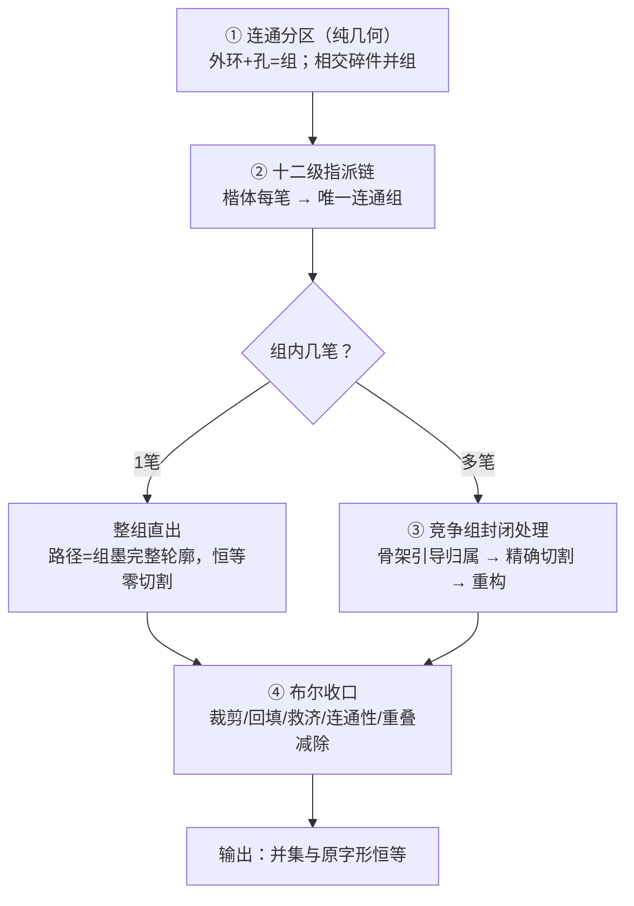
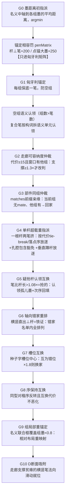
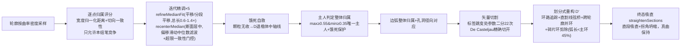
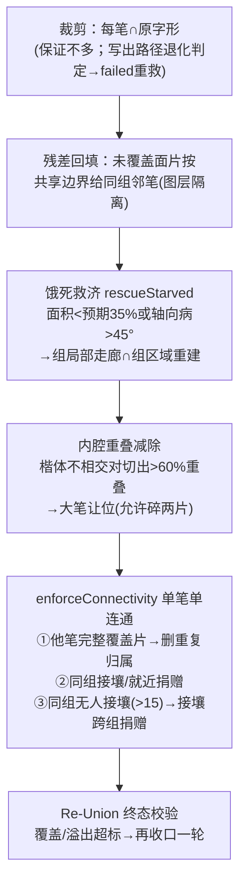

# 指派逻辑详解 —— 每笔如何找到自己的家

> 与代码同步（2026-09-12，53c91ed 后）。覆盖：连通分区 → 十二级指派链（原理+触发场景+守卫）→ 竞争组封闭处理 → 布尔收口。各级顺序与 `pipeline.runPipeline` 实际执行一致。

## 总览

**设计哲学**：墨距离代价打底（几何），一串**证据驱动的仲裁**纠错（结构）。每级仲裁只在其"病征门控"触发时介入，健康字零扰动；证据强度排序大致为：孔腔包含 > 轴向垂直矛盾 > 部件亲缘/槽位 > 楷体次序 > 走廊容纳度。

---

## ① 连通分区（指派的舞台）

**原理**：每个外环轮廓 + 挂靠其上的孔洞 = 一个连通组。判孔用**绕向法**（与最大轮廓绕向相反=孔）。**交叠件并组**（门控：组数>楷体笔数）：现代字体常不合并交叠轮廓（口 = ⊓件+底横条角部交叠靠 nonzero 渲染），相交面积>25 的外环件并查集合并。

**场景**：Noto 永 7 件并成 3 组（组数曾超笔数导致锚定无解）；鸿蒙口的 ⊓+横条并组。公理（用户裁定）：同一笔画不会断成**不相交**的连通组。

---

## ② 十二级指派链

### G0 墨距离初指派
**原理**：每笔的名义中轴线（B库骨架按楷体该笔包围盒经全局仿射摆放）重采样后，到每组墨的平均距离（墨内=0，墨外=到组边界最近距离）。每笔取 argmin。
**处理场景**：绝大多数笔一步到位——名义位置压在自己的墨上，代价≈0。
**盲区**（后续所有仲裁存在的理由）：对轴向、尺寸、部件、次序完全失明；名义位置恰好压在**别人**的墨上时代价同样≈0。

### 锚定相容罚（诊断元修复）
**原理**：verify 的不变量前置进锚定代价。杆状组（单外环无孔、伸长）× 定向笔（横/竖/提）轴向差>50° → +200；点笔 × 大墨组（对角线≥3.5×名义弦长且墨占比≥7%）→ +250。**只加进匈牙利矩阵**——argmin 就近入组与全部仲裁窗口仍用纯几何代价（罚进本体曾把爱5竖 的 G3 回家路堵死）。
**场景**：聞（竖被锚到横杆）、邸/酞/濮/蜷（楷体点的名义恰压长笔墨上，匈牙利便"点锚大墨、长笔流放点斑"）。

### G1 匈牙利锚定
**原理**：方阵最小代价完美匹配，每组保底分到一笔（防空组——空组会退化成全开竞争）；多余的笔走"自由列"随后就近入组。
**场景**：㡭 的点曾挤进邻笔组导致正主组空置。
**已知双刃剑**：错误的强制锚定会被后续 G2/G3 的"匈牙利锚定不碰"保护固化（糹族诊断点名，结构性改进候补）。

### 空组语义认领（休眠安全网）
**原理**：并组后组数仍>笔数 = 字体把复合笔画成了不相交的件。空组按墨轴向找构词含匹配语义单元的复合笔（折=前一单元取反、钩→点），D 分段走廊支撑最强者以"子笔"身份多重入组。
**场景**：为"竖折画成竖件+横件"的字体预留；当前三字体交叠并组后 0 触发。

### G2 走廊可容纳度仲裁
**原理**：名义位置不落在任何组墨内的笔会被就近错分。代价≥15 且窗口内有他组时，用"中轴线 buffer 走廊沿法向滑动、取最大单片交叠面积"比较两组谁能真正容纳整条笔，≥1.3× 才改判；原组不得因此空置。
**场景**：好的提——名义横穿撇点宽腰（墨距离胜出），真身在撇轮廓里但高度有偏（排第三）；错分后在撇点组饿死、救济还切出假提。

### G3 部件同组仲裁
**原理**：matches 部件路径是结构证据——同部件的笔在设计上倾向连通同组。当前组无任何同部件笔、代价窗口内他组有，且不空置原组 → 改判。亲缘判定用**前缀相容**（(0,1) 与 (0,1,0) 同部件——matches 深化层级不齐，exact 全等曾误判非亲）。
**场景**：爱的冖左竖——名义下半段穿过友的长横（墨内代价 0）错入长横组，mate 横钩在冖组把它领回家。

### G4 单杆超载重指派 + 垂直蹲杆
**原理**：楷体的封底横常并入现代字体的外框轮廓，其名义又恰压在腔内悬浮横杆上——两条楷体横挤一根杆，必有一伤。判据：单外环无孔高伸长（杆）内 ≥2 同向笔。放逐目标搜索带**孔腔包含豁免**：候选组带孔且杆质心落其孔腔内（"框包着悬浮杆"=结构铁证）→ 跳过代价窗拒绝并 1.5× 支撑加权。放逐者选择：两极端候选对杆代价差>25 放代价高者（tie-break），否则按**落点序一致性**（各算走廊滑动实际落点，只施行与楷体上下次序自洽的方案——按目标组质心猜方向曾放错笔）。
**垂直蹲杆扩展**：杆内 1 平行主 + 1 ⊥直笔且名义长>2×杆厚（墨装不下）→ 放逐 ⊥笔（落在"超载需≥2平行"与"错家需单笔组"夹缝的形态）。
**场景**：質/醌（封底横挤悬浮杆，落点序路径）；甲/早/曱/野（环底边代价 90-150 远超窗，靠孔腔豁免）；钾/囀（垂直蹲杆）。

### G5 疑抢杆认领互换
**原理**：全局仿射把楷体顶横的名义压到目标内部短横杆上（代价 0 抢杆直出），真身的墨融合在外框组成"孤儿墨带"无人认领。信号=**笔比杆长**（名义轴长>1.08×杆长：杆装不下它）。处置成链：k1 让出杆、认领"墨面积远超组内楷体预期"的孤儿组（走廊支撑落位）；k2（同向、代价窗口内）顺位回填杆；楷序与落点序一致才施行，每字至多一链。
**场景**：威——楷体顶横名义压在戌内短横杆上，真身顶横融合在外框；放逐-认领-回填三步归位。

### G6 轴向错家重排
**原理**：横/竖笔**直出**一根与其楷体轴向垂直的杆 = 无可辩驳的错家证据（横笔的家不可能是竖杆）。收集"单笔直出组 × 杆轴与笔楷体弦向偏差>50°"名单，名单内全排列重指派（轴向匹配<40°为合法、总偏差降 30°+ 才施行）。名单内排列=家数守恒，无超载/空组风险。杆判定：aspect≥1.5 / elong≥2.0 / 弦长≥40。
**场景**：博——6横直出竖杆、11竖撇直出横杆、8竖占斜片，三笔跨型连环错位（同型互换无解），全排列一次归位；傅/劄/銲同修。

### G7 槽位互换
**原理**：种子字统计（92.2% 部件笔数与种子精确一致）→ 槽位错位是硬证据。各一级槽位中心 = 该槽成员所在组墨质心的**中位数（排除自身防污染）**；互为错位的跨槽笔对（各自到对方槽中心×1.8 仍近于本槽中心）且互换代价≤+60 → 换家，跨型允许。
**场景**：增量防护层——鸿蒙存量已被前级清掉，价值在其他字体与未来回归。

### G8 序保持互换
**原理**：同型/相似型异组笔对，楷体质心某轴间距≥180 而目标组墨质心反向超 60（verify ORDER 同判据），互换总代价不恶化(≤+30) → 互换。ORDER 的本义"张冠李戴"只可能发生在同型笔之间（跨型方位翻转是字体比例设计差异，已降为软指标）。
**场景**：狗——犭的撇与勹的撇左右互换（偏差 500+）；妙/嫂同型换家。

### G9 组局部重锚定（相对位置代替绝对位置）
**原理**：全局仿射是绝对定位，部件比例悬殊时组内名义布局整体错位。组内≥2笔、成员名义联合框对组墨框轴向覆盖<0.8 → 用楷体**相对布局**把成员整体仿射映射到组墨框（轴对齐缩放，横竖臂保持横竖；缩放限 0.25-4×）。**守卫**：无孔单杆内≥2平行笔=未解决的超载，跳过（压缩只会钉死错误，交 G4）。v10 无门控全量复位曾净负收益——门控确保只救真错位。
**场景**：磷——石的口高瘦（y跨502），楷体口三笔名义全挤上半段、封底横悬在腔体中间差 300+ 单位；重锚定后三笔各归其位。viewer S1 红虚框=错位名义框→实线=组墨框。

### G10 D断面吸附
**原理**：bbox 重锚定是线性映射，救不了部件内部**非线性**比例差（楷体口底横在竖臂 25-36% 高、鸿蒙是 0-11% 贴底带）。走廊支撑贫瘠（<走廊标称面积 35%——绝对阈值会被横穿竖壁蹭到的"壁肉"骗过）的横/竖笔，沿法向细扫组内支撑位：**达标位置取位移最小**（全局最大曾跨越腔体跳到远端他笔杆上，肝左竖+334 跳上右壁）；目标走廊被**任意类型**他笔中轴占据≥50%采样点则放弃（横折钩竖臂曾被异型鸠占）；同向不重占、楷序保持。
**场景**：吃/吗/吓 口底横族（234字）；肝/肽/膃 ⺼旁竖。

---

## ③ 竞争组封闭处理（图层隔离）

**要点**：
- **图层隔离**：`contourAllowed` 限定每条轮廓只允许本组的笔竞争——跨组污染结构上不可能。
- **归属单位逐级放大**：逐采样点 → 整条边弧（印刷体笔画边界天然落在角点）→ 整条轮廓（主人判定）。避免直边中途碎片切换。
- **精调稳定器**：位移中位数+硬上限、总长硬约束（防点被复利拉爆）、断面居中的滑动中位数滤波（防融合区跳断面成之字）+ 大位移一致性门控（邻域同向=真偏芯放行，符号交替=蛇形拒绝）。
- **切割恒等**：保留区段与原字形路径逐点数学恒等——标准笔画骨架只引导归属，从不产生几何。

**场景**：爱的横钩曾折返 17 次（逐点断面居中在融合区跳断面）→ 滤波+门控修复；口的左竖外缘曾被横的端部评分蚕食出多段 → 边弧整体归属修复。

---

## ④ 收尾：布尔收口（硬保证层）

**原理**：无论上游拆得多差，出口处构造性保证"所有笔画并集=原字形，不多不少"（交叠区=双重归属允许）。每步都有防回退纪律：glyphRegion 减孔必须按组（全局减孔曾把中的中竖挖断）；残差回填图层隔离（跨组回填曾污染直出组）；救济走廊∩**本组**区域（∩全字形曾跨组窃墨）。

**场景**：亨/亭/勤/勵/匱/厚——融合日/目/口的封底横被外框 100% 包含 → 内腔减除让外框让位；勤的竖 2 残留 1936 面积孤儿片（距同组邻笔 178、与他组 buffer(4) 交 286）→ 接壤跨组捐赠；流江水曾终态溢出 19% → 超标强制再收口。

**可选二遍**：自洽回灌（第一遍干净中轴作种子重跑，采纳须过并集守卫+结构位置守卫+双指标）；轴向守卫重试（TYPE 病笔换楷体种子重跑，采纳须失败数减少且各项指标不恶化）。

---

## 附：仲裁触发场景速查

| 级 | 触发病征 | 代表字 | 关键守卫 |
|---|---|---|---|
| 罚 | 杆⊥笔/点锚大墨 | 聞邸酞濮蜷 | 只进锚定矩阵 |
| G2 | 代价≥15+窗口有他组 | 好(提) | 支撑≥1.3×、不空置 |
| G3 | 组内无部件mate | 爱(冖左竖) | 前缀亲缘、窗口、不空置 |
| G4 | 单杆≥2同向笔 | 質醌甲早野 | 孔腔豁免、tie-break>25、落点序 |
| G4′ | 杆内⊥直笔且长>2×杆厚 | 钾囀 | 走廊支撑、孔腔优先 |
| G5 | 笔长>1.08×杆长 | 威 | 孤儿墨面积、回填链、楷序=落点序 |
| G6 | 横竖直出⊥杆 | 博傅劄銲 | 全排列守恒、总偏差降30°+ |
| G7 | 跨槽互为错位×1.8 | (增量防护) | 代价≤+60 |
| G8 | 同型对楷序反转 | 狗妙嫂 | 间距≥180、反向>60、代价≤+30 |
| G9 | 联合框覆盖<0.8 | 磷吃 | 超载守卫、缩放0.25-4× |
| G10 | 走廊支撑<35%标称 | 吃肝肽 | 位移最小、任意型占位、楷序 |
