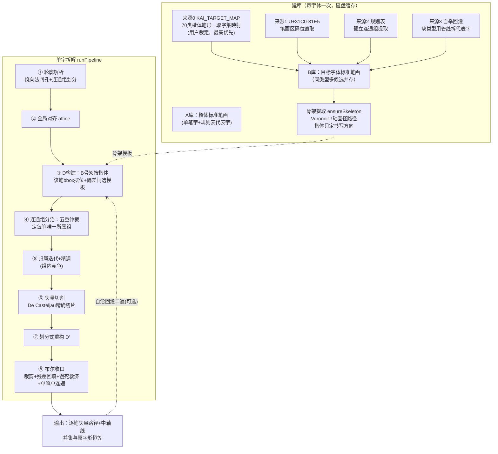
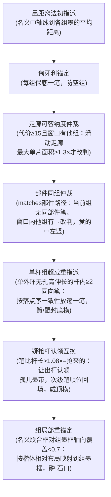
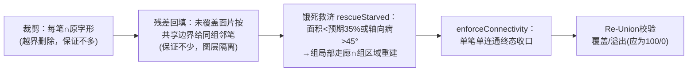

# strokelab 拆字算法说明

> 与代码同步维护（v13，2026-09-10）。本文按实际执行顺序描述当前方法；历史演进与逐版修复记录见《方案评估与说明.md》。

## 零、设计原则与硬保证

1. **纯矢量**：全程无像素/SDF 判定，输出是原字形贝塞尔段的精确切片；
2. **并集恒等**（硬保证）：所有笔画并起来与原字形不多不少，由布尔收口兜底；交叠区允许**双重归属**；
3. **楷体只供结构、不供形态**：笔顺/类型/大致位置/书写方向来自 MakeMeAHanzi 楷体（结构 C），笔画长相完全来自目标字体自己（B库骨架 = B 轮廓自身的 Voronoi 中轴）；
4. **同类型骨架拓扑一致**：横折无论何来都是干净的"7"字两直段+尖角，直笔是纯直线，真曲段保持；
5. "整字拼得回"≠"每笔拆得对"，后者靠保留率(retain)/形状匹配(shapeSim)/8类不变量校验(verify)/难例基准(bench)把关。

## 总体流程

## 一、建库（fonthub.buildLibraryB）

**B库四来源，按候选并存、逐笔由偏差闸挑选**：

| 来源 | 说明 |
|---|---|
| 来源0 `KAI_TARGET_MAP` | 用户裁定的 70 类楷体笔形→目标字体取字集映射（接管 `libraryB[t]` 队首）。每项**按优先级递减**：码位有字形直取；探针字提取只在码位缺失时启用（无码位的纯探针项恒作候选，如竖捺的`女·左下`）；`fuse`=整字融合字形做模板（乙/几）；`compose`=组合笔画首尾拼接（鬮14 提折钩=竖+横折钩） |
| 来源1 | 字体自带 U+31C0–31E5 笔画区码位 |
| 来源2 | 规则表（32类×代表字）从孤立连通组提取，形状描述子校验（形似<20%剔除）。代表字写法：`太`自动匹配 / `太4`明确笔序 / `太·下`九宫格位置词 |
| 来源3 | 自举回灌 `completeLibraryB`：仍缺的类型用当前管线拆代表字，质量闸（保留率≥90%直接放行；否则≥55%且形状≥40%）入库 |

**骨架提取 `ensureSkeleton`（v12 去楷体化）**：

- 臂长比例、弯直全来自目标字体（bbox 映射楷体中线在臂比悬殊时会斜穿墨块，已弃用为退路）；
- `midpointRectify`：候选方向=局部切向+主导方向直方图，取**最窄合法弦**的中点（真垂直笔杆的弦必最窄）；拐角区双方向弦宽差<25%歧义不动；
- `straightenSections`：预平滑（3点均值×2轮）→按拐角切段→近直段吸直→**两长直臂间短碎段坍缩为两臂直线交点**（尖角）→端部残段沿邻臂投影延伸。

**磁盘缓存** `.blibCache/<字体>.json`：键 = 字体文件(大小+mtime) × 算法签名(核心源码内容哈希)，算法一变自动失效。

## 二、单字拆解管线（pipeline.runPipeline）

### ① 轮廓解析与标注
M/L/Q/C 解析为三次贝塞尔段；**绕向法判孔**（与最大轮廓绕向相反=孔；嵌套奇偶法会误杀"孔中悬浮实体"如亘）；孔挂到最深包含外环，每个外环+其孔 = 一个**连通组**。

**交叠件并组**（门控：组数>楷体笔画数才介入）：现代字体常不合并交叠轮廓——口=⊓件+底横条角部交叠靠 nonzero 并集渲染（鸿蒙/Noto 抽样 23/23 字含交叠外环，AreaPen 实锤非提取误差）；Noto 尤碎，一笔拆成 2+ 件，组数>笔画数时匈牙利锚定无解、空组兜底退化全开竞争。公理的准确表述（用户裁定）：同一笔画不会断成**不相交**的连通组——相交的件就是连通的墨，并查集按"外环两两相交面积>25"合并。组数≤笔画数维持原流程（鸿蒙靠角部双重归属工作良好，抽样逐字零扰动）。Noto 抽样 51.56%→60.00%，SPLIT 38→0。

### ② 全局对齐
楷体整字包围盒 → 目标字形包围盒的仿射 `affine`。

### ③ D 构建
每笔：`[本类型] + similarTypes(借用)` 的全部 B 库候选，各自按楷体该笔包围盒缩放摆位，算与楷体名义位置的偏差 `_medianDeviation`。闸值：本类型 0.28 / 映射的方言型(规则表外) 0.18 / 借用 0.20 且须比本类型最优再好 0.08。全部不过→退回楷体中轴线。摆位后 `straightenSections` 保证拓扑一致。

### ④ 连通组分治（公理：同一笔画不会断成两个孤立连通组）

组数=笔画数时退化为整组直出（保留率100%、零切割）。归属/切割全部只允许本组笔画竞争。

**组局部重锚定**（相对位置代替绝对位置，用户设想落地）：全局仿射是绝对定位，部件比例悬殊时组内名义布局整体错位（磷的石口高瘦，楷体口三笔名义全挤上半段、封底横悬在腔体中间）。组内≥2笔且名义联合框对组墨框轴向覆盖<0.7 时，用楷体**相对布局**把成员整体仿射映射到组墨框（轴对齐缩放，横竖臂保持横竖；缩放限 0.25-4×）。v10 无门控全量复位曾净负收益——门控确保只救真错位，正常字零扰动。viewer S1 步骤可视化：红虚线=错位名义框→实线=组墨框。

### ⑤ 归属迭代 + 精调
轮廓按曲率密度采样，逐点按"宽度归一化距离+切向一致性"归属本组各笔 D；每轮 `refineMedianFit`（直笔平移+伸缩/折笔分段平移，总长硬约束0.6-1.4×）+ `recenterMedian` 断面居中（**偏移滑动中位数滤波**窗口±2，防融合区跳断面成之字）；饿死自救（颗粒无收→D退楷体）。迭代完成后全部 D′ 中轴线终态 `straightenSections` 吸直。

### ⑥ 矢量切割
标签跳变处沿轮廓参数二分（22次迭代），De Casteljau 精确切开——保留区段与原路径逐点恒等。

### ⑦ 划分式重构 D′
环路追踪（按轮廓参数顺序串弧段）+ 直割线弦桥接 + 环形笔画跨轮廓并环 + 孔洞径向对应；碎片环剪除（弧长<主环45%丢弃）。

### ⑧ 布尔收口（boolean.clampStrokes 等，shapely）

glyphRegion 减孔**必须按组**（孔只挖自己外环的组区域再组间取并≈nonzero），全局减孔会把穿过他组孔洞的笔挖断（中的中竖）。

### ⑨ 自洽回灌（可选二遍）
第一遍逐笔干净中轴 `_reMedianFromStroke` 作种子重跑；采纳须过并集守卫+结构位置守卫+双指标（retain升且sim不明显降）。

## 三、质量体系

- **verify.py**（确定性批量校验）：8类不变量 ERROR/COUNT/SPLIT/UNION/TYPE/ORDER/OVERLAP/AREA，校验区域与生产代码独立构造（缠绕数分层）；多进程断点续跑 + report.html。
- **bench**（难例基准）：5字体×13字逐笔 IoU 对 golden（verified/known_bad/unverified 人工核验态），`--check` 零破坏门。
- **楷体真值**：`verify --audit-kai` 部件一致性审计（matches 挂部件、组内笔位聚桶多数投票），裁决转 `kaiTypeFixes.json`（只套用复合笔形修正）随包生效；全量清单见《楷体笔画类型清单.md》（70类）。

## 四、性能要点（v13）

- `corridorOffset`/`filled`：轮廓级 bbox 剪枝（断面查询半径≪全字，多数轮廓整体落窗外；bbox 惰性缓存挂轮廓对象复用）——5字管线 38.9s→9.3s（4.2×）；
- `nearestOnPolyline`：内环平方距离比较，免逐段开方；
- 建库内 `analyzed` 共享：同一代表字（如刁被提/横折钩/横提等多类引用）只做一次连通组分析；
- B库磁盘缓存 + 组区域构建 `_groupRegionOf` 单一实现共用。
- **numpy 批量化（v14）**：`nearestBatch`（点集×折线全段矩阵最近点，内部平方距离比较与标量版逐位一致，含并列平票的 argmin 语义）、`_pipVec`（向量化点在多边形内含闭合边）、`_edgeArrays`（轮廓边数组惰性缓存）三个批量原语，替换四处热循环：归属迭代打分（笔×采样点整矩阵）、走廊断面 `corridorOffset`、中轴精调 `refineMedianFit` 双分支、宽度估计。**逐路径字节级等价**（74字 parity + TC/毛草/雅黑抽查 0 差异），5字体重profile 14.4s→5.7s（2.5×）。
- **C++ 路线评估**：当前热点已被 numpy/shapely（后者本身是 C++ GEOS）吃掉大头；剩余收益点是纯 Python 的组仲裁与切割逻辑，适合稳定后用 pybind11/Rust(PyO3) 做内核下沉，不建议整体重写。
