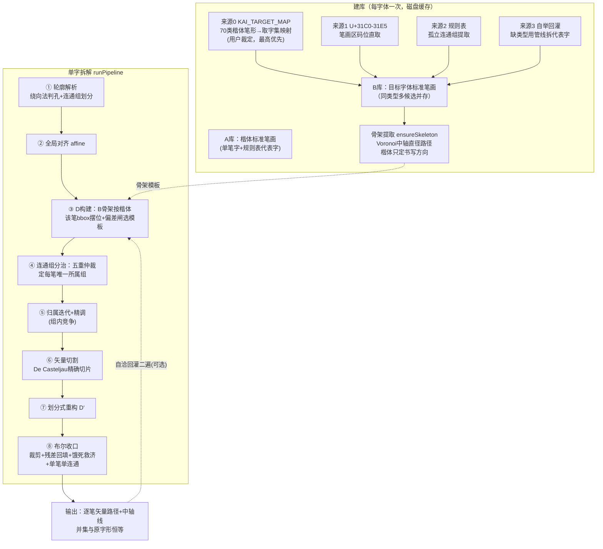
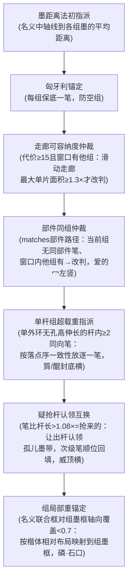
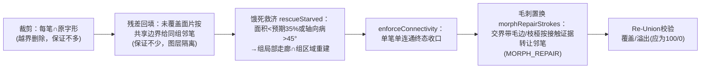

# strokelab 拆字算法说明

> 与代码同步维护（v13，2026-09-10）。本文按实际执行顺序描述当前方法；历史演进与逐版修复记录见《方案评估与说明.md》。

## 零、设计原则与硬保证

1. **纯矢量**：全程无像素/SDF 判定，输出是原字形贝塞尔段的精确切片；
2. **并集恒等**（硬保证）：所有笔画并起来与原字形不多不少，由布尔收口兜底；交叠区允许**双重归属**；
3. **楷体只供结构、不供形态**：笔顺/类型/大致位置/书写方向来自 MakeMeAHanzi 楷体（结构 C），笔画长相完全来自目标字体自己（B库骨架 = B 轮廓自身的 Voronoi 中轴）；
4. **同类型骨架拓扑一致**：横折无论何来都是干净的"7"字两直段+尖角，直笔是纯直线，真曲段保持；
5. "整字拼得回"≠"每笔拆得对"，后者靠保留率(retain)/形状匹配(shapeSim)/8类不变量校验(verify)/难例基准(bench)把关。

## 总体流程

```mermaid
flowchart TD
    subgraph 建库["建库（每字体一次，磁盘缓存）"]
        A0["A库：楷体标准笔画<br>(单笔字+规则表代表字)"]
        B0["来源0 KAI_TARGET_MAP<br>70类楷体笔形→取字集映射<br>(用户裁定，最高优先)"]
        B1["来源1 U+31C0-31E5<br>笔画区码位直取"]
        B2["来源2 规则表<br>孤立连通组提取"]
        B3["来源3 自举回灌<br>缺类型用管线拆代表字"]
        SK["骨架提取 ensureSkeleton<br>Voronoi中轴直径路径<br>楷体只定书写方向"]
        B0 & B1 & B2 & B3 --> LIB["B库：目标字体标准笔画<br>（同类型多候选并存）"]
        LIB --> SK
    end
    subgraph 逐字["单字拆解 runPipeline"]
        P0["① 轮廓解析<br>绕向法判孔+连通组划分"]
        P1["② 全局对齐 affine"]
        P2["③ D构建：B骨架按楷体<br>该笔bbox摆位+偏差闸选模板"]
        P3["④ 连通组分治：五重仲裁<br>定每笔唯一所属组"]
        P4["⑤ 归属迭代+精调<br>(组内竞争)"]
        P5["⑥ 矢量切割<br>De Casteljau精确切片"]
        P6["⑦ 划分式重构 D′"]
        P7["⑧ 布尔收口<br>裁剪+残差回填+饿死救济<br>+单笔单连通"]
        P0 --> P1 --> P2 --> P3 --> P4 --> P5 --> P6 --> P7
    end
    SK -.骨架模板.-> P2
    P7 --> OUT["输出：逐笔矢量路径+中轴线<br>并集与原字形恒等"]
    OUT -.自洽回灌二遍(可选).-> P2
```

## 一、建库（fonthub.buildLibraryB）

**B库四来源，按候选并存、逐笔由偏差闸挑选**：

| 来源 | 说明 |
|---|---|
| 来源0 `KAI_TARGET_MAP` | 用户裁定的 70 类楷体笔形→目标字体取字集映射（接管 `libraryB[t]` 队首）。每项**按优先级递减**：码位有字形直取；探针字提取只在码位缺失时启用（无码位的纯探针项恒作候选，如竖捺的`女·左下`）；`fuse`=整字融合字形做模板（乙/几）；`compose`=组合笔画首尾拼接（鬮14 提折钩=竖+横折钩） |
| 来源1 | 字体自带 U+31C0–31E5 笔画区码位 |
| 来源2 | 规则表（32类×代表字）从孤立连通组提取，形状描述子校验（形似<20%剔除）。代表字写法：`太`自动匹配 / `太4`明确笔序 / `太·下`九宫格位置词 |
| 来源3 | 自举回灌 `completeLibraryB`：仍缺的类型用当前管线拆代表字，质量闸（保留率≥90%直接放行；否则≥55%且形状≥40%）入库 |

**骨架提取 `ensureSkeleton`（v12 去楷体化）**：

```mermaid
flowchart LR
    C["B笔画轮廓"] --> V["边界加密采样<br>→ Voronoi边(墨内)建图"]
    V --> D["两次Dijkstra取<br>最远叶对=中线主干"]
    D --> P1["剪端帽角枝<br>(余隙<0.9×中位)"]
    P1 --> P2["轻度平滑+端点<br>沿端部切向延伸补齐"]
    P2 --> R["midpointRectify<br>法向最窄弦中点矫正"]
    R --> S["straightenSections<br>分段吸直+拐角坍缩"]
    S --> K["骨架(方向由楷体定)"]
```

- 臂长比例、弯直全来自目标字体（bbox 映射楷体中线在臂比悬殊时会斜穿墨块，已弃用为退路）；
- `midpointRectify`：候选方向=局部切向+主导方向直方图，取**最窄合法弦**的中点（真垂直笔杆的弦必最窄）；拐角区双方向弦宽差<25%歧义不动；
- `straightenSections`：预平滑（3点均值×2轮）→按拐角切段→近直段吸直→**两长直臂间短碎段坍缩为两臂直线交点**（尖角）→端部残段沿邻臂投影延伸。

**磁盘缓存** `.blibCache/<字体>.json`：键 = 字体文件(大小+mtime) × 算法签名(核心源码内容哈希)，算法一变自动失效。

## 二、单字拆解管线（pipeline.runPipeline）

### ① 轮廓解析与标注
M/L/Q/C 解析为三次贝塞尔段；**绕向法判孔**（与最大轮廓绕向相反=孔；嵌套奇偶法会误杀"孔中悬浮实体"如亘）；孔挂到最深包含外环，每个外环+其孔 = 一个**连通组**。

**交叠件并组**（门控：组数>楷体笔画数才介入）：现代字体常不合并交叠轮廓——口=⊓件+底横条角部交叠靠 nonzero 并集渲染（鸿蒙/Noto 抽样 23/23 字含交叠外环，AreaPen 实锤非提取误差）；Noto 尤碎，一笔拆成 2+ 件，组数>笔画数时匈牙利锚定无解、空组兜底退化全开竞争。公理的准确表述（用户裁定）：同一笔画不会断成**不相交**的连通组——相交的件就是连通的墨，并查集按"外环两两相交面积>25"合并。组数≤笔画数维持原流程（鸿蒙靠角部双重归属工作良好，抽样逐字零扰动）。Noto 抽样 51.56%→60.00%，SPLIT 38→0。

### ② 全局对齐
楷体整字包围盒 → 目标字形包围盒的仿射 `affine`。

### ③ D 构建
每笔：`[本类型] + similarTypes(借用)` 的全部 B 库候选，各自按楷体该笔包围盒缩放摆位，算与楷体名义位置的偏差 `_medianDeviation`。闸值：本类型 0.28 / 映射的方言型(规则表外) 0.18 / 借用 0.20 且须比本类型最优再好 0.08。全部不过→退回楷体中轴线。摆位后 `straightenSections` 保证拓扑一致。

### ④ 连通组分治（公理：同一笔画不会断成两个孤立连通组）

```mermaid
flowchart TD
    G0["墨距离法初指派<br>(名义中轴线到各组墨的平均距离)"]
    G1["匈牙利锚定<br>(每组保底一笔，防空组)"]
    G2["走廊可容纳度仲裁<br>(代价≥15且窗口有他组：滑动走廊<br>最大单片面积≥1.3×才改判)"]
    G3["部件同组仲裁<br>(matches部件路径：当前组无同部件笔、<br>窗口内他组有→改判，爱的冖左竖)"]
    G4["单杆组超载重指派<br>(单外环无孔高伸长的杆内≥2同向笔：<br>按落点序一致性放逐一笔，質/醌封底横)"]
    G5["疑抢杆认领互换<br>(笔比杆长>1.08×=抢来的：让出杆认领<br>孤儿墨带，次级笔顺位回填，威顶横)"]
    G6["组局部重锚定<br>(名义联合框对组墨框轴向覆盖<0.7：<br>按楷体相对布局映射到组墨框，磷·石口)"]
    G0 --> G1 --> G2 --> G3 --> G4 --> G5 --> G6
```

组数=笔画数时退化为整组直出（保留率100%、零切割）。归属/切割全部只允许本组笔画竞争。

**组局部重锚定**（相对位置代替绝对位置，用户设想落地）：全局仿射是绝对定位，部件比例悬殊时组内名义布局整体错位（磷的石口高瘦，楷体口三笔名义全挤上半段、封底横悬在腔体中间）。组内≥2笔且名义联合框对组墨框轴向覆盖<0.7 时，用楷体**相对布局**把成员整体仿射映射到组墨框（轴对齐缩放，横竖臂保持横竖；缩放限 0.25-4×）。v10 无门控全量复位曾净负收益——门控确保只救真错位，正常字零扰动。viewer S1 步骤可视化：红虚线=错位名义框→实线=组墨框。

### ⑤ 归属迭代 + 精调
轮廓按曲率密度采样，逐点按"宽度归一化距离+切向一致性"归属本组各笔 D；每轮 `refineMedianFit`（直笔平移+伸缩/折笔分段平移，总长硬约束0.6-1.4×）+ `recenterMedian` 断面居中（**偏移滑动中位数滤波**窗口±2，防融合区跳断面成之字）；饿死自救（颗粒无收→D退楷体）。迭代完成后全部 D′ 中轴线终态 `straightenSections` 吸直。

### ⑥ 矢量切割
标签跳变处沿轮廓参数二分（22次迭代），De Casteljau 精确切开——保留区段与原路径逐点恒等。

### ⑦ 划分式重构 D′
环路追踪（按轮廓参数顺序串弧段）+ 直割线弦桥接 + 环形笔画跨轮廓并环 + 孔洞径向对应；碎片环剪除（弧长<主环45%丢弃）。

### ⑧ 布尔收口（boolean.clampStrokes 等，shapely）

```mermaid
flowchart LR
    C1["裁剪：每笔∩原字形<br>(越界删除，保证不多)"]
    C2["残差回填：未覆盖面片按<br>共享边界给同组邻笔<br>(保证不少，图层隔离)"]
    C3["饿死救济 rescueStarved：<br>面积<预期35%或轴向病>45°<br>→组局部走廊∩组区域重建"]
    C4["enforceConnectivity：<br>单笔单连通终态收口"]
    C5["毛刺置换 morphRepairStrokes：<br>交界带毛边/枝桠按接触证据<br>转让邻笔(MORPH_REPAIR)"]
    C1 --> C2 --> C3 --> C4 --> C5 --> U["Re-Union校验<br>覆盖/溢出(应为100/0)"]
```

glyphRegion 减孔**必须按组**（孔只挖自己外环的组区域再组间取并≈nonzero），全局减孔会把穿过他组孔洞的笔挖断（中的中竖）。

**毛刺置换**（形态修复器，`boolean.MORPH_REPAIR` 开关，默认开，2026-09-16）：
衬线体交叉组切割后交界带留毛边/枝桠（simsun 永 横折钩沿捺左 flank 187
长斜楔，retain 0.82+2桥）。挂点=收口链最末（归属/切割/救济/补缝尘埃
落定后只做交界再划界）。检测门=retain<0.95 或桥≥2 且有同组邻笔；单笔
区域按 nonzero 建中轴图，短叶枝（<max(2×挂点余隙,40)，verify 审计同
口径）与伪臂（剪稳后链长<250 的叶链——粘连尾巴长于笔宽逃过 spur 阈）
为补丁锚；补丁=沿链逐点圆盘（r=2×局部余隙）并集闭运算∩本笔区域；
置换判据=**补丁与邻笔边界接触长度>挂回本笔颈宽**（"挂在别人身上的
肉"）。转让为 difference/union 对偶，并集恒等天然保持。

all-or-nothing 守卫（全部实跑标定，boolean 常数注有字例）：执行域=
junc≥1 的交叉型病笔（spur-only 锯齿搬运净害）；域一致门（nonzero/奇偶
几何一致 + verify 口径 flat=4 拓扑一致——SC 筻 缎带两展平 164 vs 268）；
逐补丁单连通；面积化 retain 门（单补丁≤35%/合计≤45%）；本笔 junc 不升
+junc+spur 严格降+最小收益 5；受让方守卫（重病分>30 不受让+恶化合计
≤2×收益+2）；OVERLAP 越线守卫（全笔对，跨组也查——蝮 9-10 教训）；
受让过肉的笔本轮禁再捐（ping-pong 禁令）；0.01 精度专用写手+写出域
复核（0.1 舍入锯齿恰在中轴图 -0.05 腐蚀带量级，假 spur +12 实测）。

真收益走级联：置换→终态中轴重提种子更干净→自洽二遍重切整体更优
（永 junc 7→2、spur 19→11、retain +0.027；歛 junc 20→0）。级联外溢由
**采纳否决** `finalize._morphAdoptVeto` 兜底（prev/cand 任一侧有置换
即审）：重跑退化笔增多、均 retain 降>0.02、笔对重叠比>0.55 且比前值
恶化>0.05 均不采纳；重跑修掉退化笔则优先放行（歛）。诊断
`result.morphRepairs=[[笔,补丁数,受让笔],…]`（关闭态不加键，与基线
逐字节一致；采纳继承照 ladderRealign 先例）。
STROKELAB_MORPH_REPAIR=0 关（spawn worker 继承语义同 CLIB）。

**受害者取回**（毛刺置换的反向执行域，2026-09-26）：simsun 威·笔0 型
病理与 donor 主导相反——顶横左端 x148-208 被撇硬切走（两件交叠=0），
悬肉长在**健康邻笔的中轴终端链**上：撇剪稳后是纯路径图（junc=0），楔
是主链末端，donor 侧 spur/arm 框架按定义不可见。取回=受害者主导：
retain<0.93 的笔（donor 置换未果后）扫同组邻笔的终端链找**贴壁前缀**
（中轴点到受害者距离≤1.1×自身余隙+2——受害者边界就是该段的一面墙，
悬肉沿切割缝生长的几何本质；贴壁长须>max(1.5×切点余隙,25)，丁字自然
对接的笔端贴壁≈自身颈宽被拒）；在前缀尽头**垂直刀截断**（直刀而非圆
盘减除：圆弧切口经 0.01 写手+重展平每道弦折成一根假 spur，威·撇 写出
域 2→16 实测），补丁按同一张判据（接触>1.15×切颈）转让。治愈双门：
增肉≥0.5×缺口 且 取回后 retain 跨回 0.93（部分缝补=搬椅子——草 底横
0.467→0.586 治不好=病根在别处，正确不动；赢家 威笔0 0.887→0.963、
我笔0 0.911→0.968）。共享守卫：双侧域一致+verify 口径前值、双侧单
连通、OVERLAP 越线、双侧轴向漂移、写出域复核（双侧形态分≤前值+4）；
取回受方本轮禁再捐、捐方禁再当受害者（ping-pong 双向禁令）。
retainRatio 双侧按面积比改写（取回的存在意义就是修 retain，verify
m.retain 直读该字段；donor 置换不改写——毛边量级，改写徒增采纳噪声）。

### ⑨ 自洽回灌（可选二遍）
第一遍逐笔干净中轴 `_reMedianFromStroke` 作种子重跑；采纳须过并集守卫+结构位置守卫+双指标（retain升且sim不明显降）。

## 三、质量体系

- **verify.py**（确定性批量校验）：8类不变量 ERROR/COUNT/SPLIT/UNION/TYPE/ORDER/OVERLAP/AREA，校验区域与生产代码独立构造（缠绕数分层）；多进程断点续跑 + report.html。
- **bench**（难例基准）：5字体×13字逐笔 IoU 对 golden（verified/known_bad/unverified 人工核验态），`--check` 零破坏门。
- **楷体真值**：`verify --audit-kai` 部件一致性审计（matches 挂部件、组内笔位聚桶多数投票），裁决转 `kaiTypeFixes.json`（只套用复合笔形修正）随包生效；全量清单见《楷体笔画类型清单.md》（70类）。

### 形态审计（软指标，2026-09-14 第一步）

"形态与标准笔画一致性"审计的第一步：只落指标不设硬门，进 verify 每字 `m{}`，不参与 fails 判定；阈值/预算由公司机全库分布标定后再议升门。

**指标定义**（verify.verifyChar）：

- `morphJunc`：全部审计笔的中轴图交叉节点（度3+）数合计。单笔区域由该笔切割路径按 nonzero 语义独立构造（外环并集减反绕向孔环并集，语义同 `boolean.glyphRegion`/`tools.calib_frame_rows.groupRegion`，实现独立），`geometry._medialAdjacency` 建中轴图后先剪短叶枝再计度。
- `morphSpur`：短叶枝数合计——链长 < max(2×挂点余隙, 40) 的叶链（2×余隙≈挂点处笔宽：短于笔宽的叶枝是轮廓锯齿/衬线噪声；长于笔宽的伪臂保留计入 morphJunc，正是要抓的切割残余/粘连尾巴）。
- `morphBad`：交叉节点数超拓扑预算的笔数。

**拓扑预算表**（`verify.MORPH_BUDGET`，保守初值，待公司机全库分布标定后修订）：

| 类型类 | 上限 | 依据 |
|---|---|---|
| 单元素直笔（横竖撇捺点提） | 1 | 理想中轴是无分叉链（0 交叉），留 1 容忍衬线/端饰残余 |
| 折/钩类（类型名含"折"或"钩"） | 4 | 拐角/钩尖常挂 1-2 个真分叉 |
| 其余复合笔 | 6 | 多段折笔分叉上限放宽 |

**审计范围**（控成本，Voronoi 是大头）：仅 retain<0.98 或所在连通组≥2笔 的非 failed 笔——独组且近全保留的笔就是原生轮廓件，形态无需复核。实测审计开销均值约 115ms/审计笔（81-205ms，大笔更贵）、HarmonyOS sample 抽样 +0.56s/字（+19%）。

**病例标定锚点**（2026-09-14 实测）：simsun 永 横折钩 junc=7>4 → morphBad=1；simhei 草 #7横 junc=2、simkai 草 #5横 junc=30 → 各 morphBad=1；simsun 草 病笔为越界侵入型（横折左端斜尾+竖底 L 脚），拓扑分支在叶枝剪除后消解 → morphBad=0，信号落在 morphSpur=26（#4横折 spur=6，健康笔约 2）——侵入型病待 spur 分布标定或几何指标补充。健康对照鸿蒙 永 全零、国 morphJunc=0/morphBad=0（spur=5 为切割搭接角噪底噪）。

**标定流程**（公司机）：全库多字体跑 verify（morph 指标随 jsonl 落盘）→ 按 类型类×字体 聚合 junc/spur 分布 → 以健康分位（如 P99）修订 MORPH_BUDGET 与 spur 阈 → 病例锚点复核（上表四字）→ 再议是否升硬门（MORPH 失败码）。

## 四、性能要点（v13）

- `corridorOffset`/`filled`：轮廓级 bbox 剪枝（断面查询半径≪全字，多数轮廓整体落窗外；bbox 惰性缓存挂轮廓对象复用）——5字管线 38.9s→9.3s（4.2×）；
- `nearestOnPolyline`：内环平方距离比较，免逐段开方；
- 建库内 `analyzed` 共享：同一代表字（如刁被提/横折钩/横提等多类引用）只做一次连通组分析；
- B库磁盘缓存 + 组区域构建 `_groupRegionOf` 单一实现共用。
- **numpy 批量化（v14）**：`nearestBatch`（点集×折线全段矩阵最近点，内部平方距离比较与标量版逐位一致，含并列平票的 argmin 语义）、`_pipVec`（向量化点在多边形内含闭合边）、`_edgeArrays`（轮廓边数组惰性缓存）三个批量原语，替换四处热循环：归属迭代打分（笔×采样点整矩阵）、走廊断面 `corridorOffset`、中轴精调 `refineMedianFit` 双分支、宽度估计。**逐路径字节级等价**（74字 parity + TC/毛草/雅黑抽查 0 差异），5字体重profile 14.4s→5.7s（2.5×）。
- **C++ 路线评估**：当前热点已被 numpy/shapely（后者本身是 C++ GEOS）吃掉大头；剩余收益点是纯 Python 的组仲裁与切割逻辑，适合稳定后用 pybind11/Rust(PyO3) 做内核下沉，不建议整体重写。
